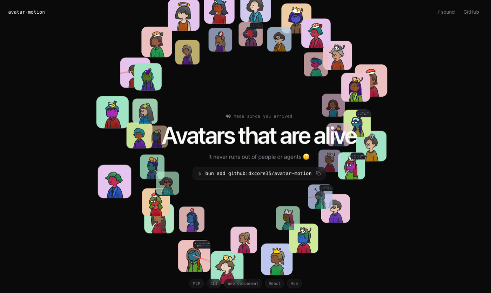
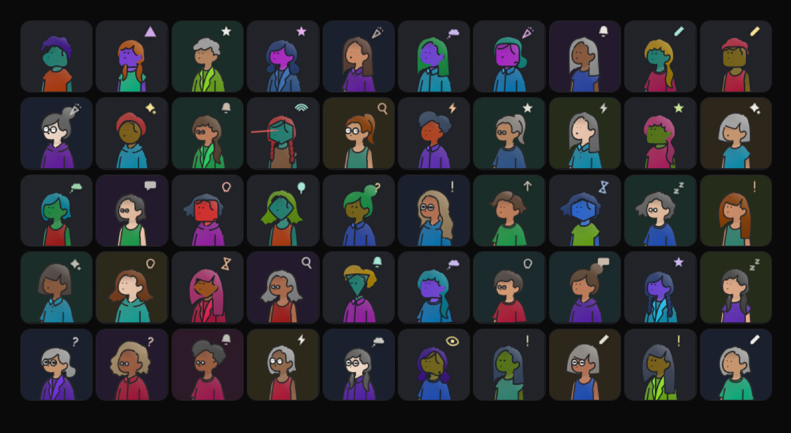
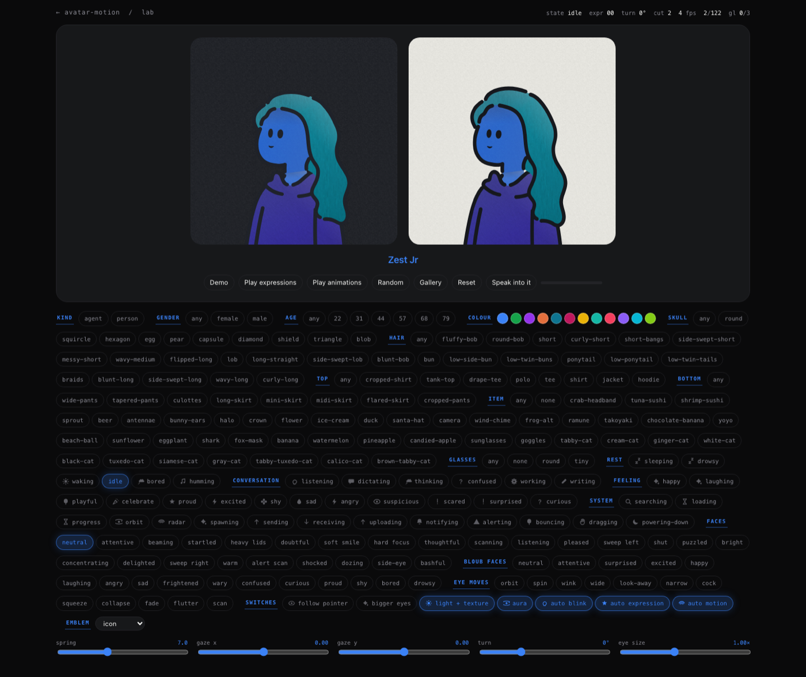

# aliveatar

**Living avatars for AI agents and people.** One string in, one character out —
the same one every time. It blinks, breathes, looks around, and shows what your
agent is doing right now.

No build step. No dependencies. MIT, all of it.



## Built on

The drawn people are **not this project's artwork**. Every head, body, bottom,
item and pair of glasses comes from
**[Humation](https://github.com/endo-yusuke/humation)** (MIT), vendored
unmodified. The eye motion is ported from a
[public gist](https://gist.github.com/smontlouis/49a4c9303de70118a90dc43badc1aba5)
by Jérémy Perret (MIT). Everything added here happens at runtime and never edits
the art. Both licences are in [`LICENSE`](LICENSE).

## Install

```bash
bun add github:dxcore35/aliveatar
```

## Use

```html
<script type="module" src="aliveatar/src/avatar-motion.js"></script>

<avatar-motion seed="reception-01" state="listening"></avatar-motion>
```

Only `seed` is required. It is a web component, so the same tag works in plain
HTML, React, Vue or Svelte.

## Properties

| Attribute | Values | What it does |
|---|---|---|
| `seed` | any string | The id. The same string is always the same character. |
| `kind` | `agent` · `customer` | An AI mascot, or a person. Agents may run tools; people do not. |
| `color` | any hex | An agent's signature colour. It becomes the skin. |
| `gender` | `male` · `female` | Constrains hair and lower body. Omit for either. |
| `age` | a number | Greying, reading glasses, a slower pace. |
| `state` | 39 of them | What the face is doing — eyes, brow, mouth, posture and the symbol over the head, together. `avatar options` prints the list. |
| `skull` | `round` `squircle` `hexagon` `egg` `pear` `capsule` `diamond` `shield` `triangle` `blob` | The generated head shape. Agents only. |
| `head` | 24 names | Force a hairstyle instead of letting the seed pick. |
| `body` | 8 names | Force a top. |
| `bottom` | 8 names | Force a lower body. |
| `item` | 43 names | Force a hat, pet or held object. |
| `glasses` | `none` `round` `tiny` | Force glasses. Otherwise age and tool calls decide. |
| `emblem` | `icon` · `item` · `off` | The symbol over the head, the Humation hat, or nothing. |
| `mouse-interactive` | flag | The eyes follow the pointer. |
| `demo` | flag | Run a scripted demo on a loop. |
| `flat` | flag | Skip lighting, texture and grain. |
| `no-aura` | flag | Never claim a WebGL surface. |
| `no-mount` | flag | Skip the arrival animation. |
| `transparent-bg` | flag | Do not paint the avatar's own background. |

`avatar options` prints every legal part name at any time.

### Methods

```js
el.setState('thinking')
el.runTool({ name: 'search_calendar', args: '{ day: "tue" }', result: '3 slots' })
el.send({ type: 'speech.attach', stream })   // the mouth follows real audio
el.blink(); el.spin(); el.remount(); el.playAct('scan')
```

## Gallery

Every face here was made by the same generator the library ships. None of them
were picked, drawn or arranged — the seed did all of it.



## The lab

`/lab.html` is where you try things: both themes side by side, every state,
every part, all 41 eye moves, the spring, and an endless crowd. Nothing in it
is a mock-up — it drives the same element you install.



## CLI

Drive any avatar in an open page from a terminal. Start the bridge, add
`?bridge` to the page URL, then:

```bash
avatar state listening
```

```bash
avatar random kind=customer
```

```bash
avatar options
```

`avatar tool.start`, `avatar parts`, `avatar act.play` and `avatar say` work the
same way. A wrong value comes back with the legal ones attached.

## MCP — let Claude drive the face

```bash
claude mcp add avatar -- bun /path/to/aliveatar/mcp/server.js
```

That is the whole setup. Twenty-one tools appear, generated from the same command
list the CLI uses. Ask Claude to make the receptionist look busy, and it will.

## Run it

```bash
bun run dev
```

<http://localhost:4330> is the site, `/lab.html` is the workbench — every state,
all 41 eye types, the spring, an endless crowd.

```bash
bun run bridge
```

Starts the bridge on :4332, which is what the CLI and MCP talk to.

## Deploy

There is no server code and no build step, so any static host serves the repo
as it stands.

```bash
vercel --prod
```

`vercel.json` is already here; it only sets cache headers. Other paths —
Docker, or a Cloudflare Tunnel that publishes over HTTPS without opening a port
— are in [`DEPLOY.md`](DEPLOY.md).

## Speech

The mouth is driven by the audio the agent is actually producing, not by a timer.
Loudness opens the jaw; the brightness of the sound shapes the lips. No phoneme
model, so it works on Slovak exactly as on English — it reads the waveform.

```js
el.send({ type: 'speech.attach', stream })   // a MediaStream, an <audio>, or a node
```

## How it behaves in production

One `requestAnimationFrame` drives every avatar on the page. Off-screen avatars
and hidden tabs stop completely. The simulation runs at a fixed 120 Hz step,
separate from drawing, so a slow frame changes nothing about the motion.
`prefers-reduced-motion` is honoured. The WebGL aura is pooled three deep, and
any avatar can decline it with `no-aura`.

## Where things are

`src/humation.js` composes the drawing, cuts the drawn-on eyes out and measures
the head as a sphere. `src/engine.js` runs the simulation and the draw pass.
`src/states.js` holds all 39 states. `src/control.js` is one command set shared
by the page, the CLI and MCP, so those three can never drift.

`bin/avatar.js` is the CLI, `mcp/server.js` the MCP server, `tools/bridge.js`
the wire between them and a page.

## How it works

The engineering write-up — the seam between the two systems, what makes the
motion read as real, what the look pass costs, and how an AI is deliberately
not animated like a person — is in [`docs/ENGINE.md`](docs/ENGINE.md).

## Licence

MIT — [`LICENSE`](LICENSE), third-party credits included.
