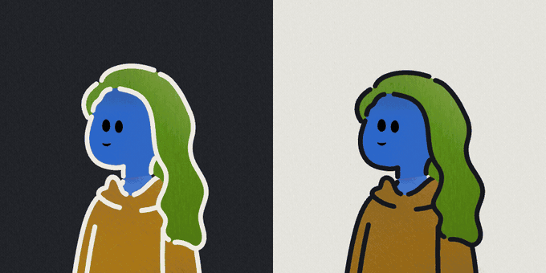
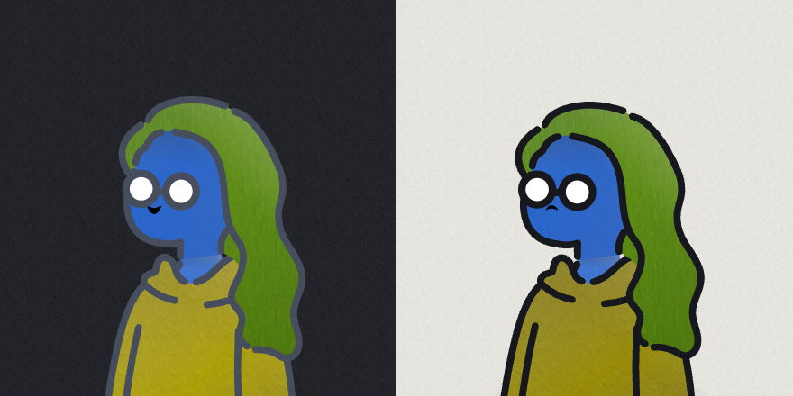
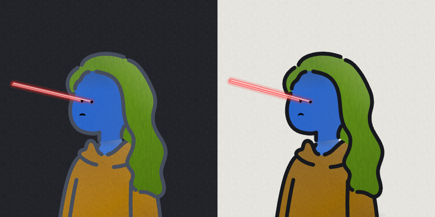

# avatar-motion

Deterministic, animated avatars for a voice-agent platform. One seed always
gives the same person; the face is driven by the agent's real audio and its real
tool calls.



*Left: dark mode. Right: light mode. Same person, same seed, same animation —
running side by side so a bug that only shows in one theme cannot hide.*

| Running a tool | Searching |
|---|---|
|  |  |

It merges two things that already existed:

- **Humation** — the modular person used by AgentDesk's `EntityIcon`. A seed picks
  a head, body, bottom, item and glasses, and a palette recolours them. Same id,
  same person, every time. It is a still drawing.
- **The GrokBot face engine** — the animation system reverse-engineered in
  [this gist](https://gist.github.com/smontlouis/49a4c9303de70118a90dc43badc1aba5).
  Spring morphs between eye shapes, a blink curve, a gaze clamp, eyes projected
  onto a head sphere, and a state machine of expression pools and cadences.

Humation says **who**. The engine says **alive**. This project is the seam.

**Nothing in the Voice AI platform is touched.** The Humation packages are
vendored read-only into `vendor/`; `AgentDesk-Unified/` is not modified.

## Run it

```bash
cd avatar-motion && bun run dev
```

Then open <http://localhost:4330>. There is no build step and no install — the
Humation packages are pre-bundled into `vendor/humation.bundle.js`.

## Use it

```html
<avatar-motion seed="agent:reception-01" kind="agent" color="#3B82F6"
               state="listening" emblem="icon" mouse-interactive></avatar-motion>
```

| Attribute | Meaning |
|---|---|
| `seed` | stable id → the same person every time |
| `kind` | `agent` (coloured AI mascot) or `customer` (person) |
| `color` | the agent's signature colour, used as its skin |
| `gender` | `male` / `female` — constrains hair and lower body |
| `state` | any of the 39 states in `src/states.js` |
| `head` `body` `bottom` `item` `glasses` | force a specific Humation part |
| `emblem` | `icon` drawn set · `auto` emoji · `item` Humation hat/pet · `off` |
| `mouse-interactive` | the eyes follow the pointer (real smooth pursuit) |
| `flat` | skip the lighting, texture and grain pass |
| `no-aura` | never claim a WebGL surface |
| `demo` | run the scripted demo on a loop |
| `no-mount` | skip the arrival animation |
| `transparent-bg` | do not paint the avatar's own background |

```js
el.runTool({ name: 'calendar.find_slot', args: '{ day: "tue" }', result: '3 slots' })
el.blink(); el.spin(1); el.remount(); el.setState('thinking'); el.setExpression(17)
```

## Speech — the point of it, for a voice agent

The mouth is driven by the **audio the agent is actually producing**, not by a
timer. A timed mouth desynchronises from the voice within a sentence; a mouth
driven by the waveform stays locked to it forever, in any language, with no
phoneme model and no alignment step.

Full viseme recognition needs an aligner, and you do not need one. You do not
have to know *which* vowel is being said to draw a convincing mouth — only how
**open** it is and how **wide**. Two numbers off an FFT give both:

- **loudness** → how far the jaw drops
- **spectral centroid** → where the energy sits. Open back vowels ("aa", "oh")
  put it low; front vowels and sibilants ("ee", "s") put it high. Low → round
  and open, high → wide and flat.

Consonant closures matter as much as vowels: real speech snaps shut on every
p, b and m, so a fast drop in loudness closes the mouth hard, and the release
is slower than the closure. Loud syllables also push the head — the small
emphatic nods people make on stressed words, which is most of what separates
good lip sync from cheap lip sync.

```js
avatar.send({ type: 'speech.attach', stream: livekitTrack.mediaStream })
// or, when the audio is not reachable from the browser:
avatar.send({ type: 'speech.level', level: 0.7, tone: 0.4 })
```

**Emotion tags.** TTS scripts usually already carry them, which makes them the
cheapest possible source of truth about delivery — the copy says it.

```js
const { clean } = avatar.send({ type: 'say', text: '[happy] Found it! [thinking] one moment', ms: 2400 })
tts.speak(clean)  // tags stripped; the face is cued across the utterance
```

## Driving it from an app

One entry point, plain JSON in, events out. Deliberately **not** MCP: MCP exists
so a *model* can discover and call tools, and this is a UI component being
driven by an app that already knows what it wants. If you do want MCP later,
`MANIFEST` is already the tool list.

```js
avatar.send({ type: 'state', state: 'listening' })
avatar.send({ type: 'tool.start', name: 'kb.search', args: '{ q: "hours" }', result: '2 docs' })
avatar.send({ type: 'identity', seed: 'customer:4821', kind: 'customer', age: 67 })
avatar.addEventListener('avatar-event', (e) => console.log(e.detail.name))

avatar.send({ type: 'manifest' })   // every command, discoverable at runtime
```

15 commands, 8 events. Unknown commands come back as an `error` event rather
than throwing — a control channel that can crash the UI is not a control
channel.

## Age

Age is real data a CRM usually has, and it is a stronger signal for how someone
looks and moves than any random seed. Pass it and it drives greying, reading
glasses (presbyopia is near-universal past 45), which clothes are likely, and
how fast the person moves. Leave it out and the seed decides everything, exactly
as before.

## Production behaviour

This is the part that decides whether it can go in a real list view.

- **One `requestAnimationFrame` for the whole page.** Fifty avatars share one
  loop (`src/core/ticker.js`). Fifty independent loops is the usual way this
  kind of thing gets shipped and the usual reason it has to be removed again.
- **Fixed 120 Hz physics.** Springs settle identically on a 60 Hz laptop and a
  144 Hz monitor. Drawing still happens once per real frame.
- **Off-screen avatars stop**, via one shared `IntersectionObserver`, and give
  back their WebGL surface.
- **A hidden tab stops**, and resumes without simulating the elapsed time — no
  lurch when you come back.
- **`prefers-reduced-motion` is obeyed**, and *watched*, not read once: turning
  it on mid-session calms every avatar and drops the shader.
- **The shader is capped**: at most 3 live WebGL contexts on the page, 144×144
  each, 30 fps, skipped when nothing is happening. Worst case for the whole
  page is about 1.9 megapixels a second. No WebGL, no context free, or reduced
  motion → the avatar simply renders without an aura.
- **Texture is a tiled image, not an SVG filter.** A filter re-runs whenever
  anything inside it changes, and this avatar has a face moving in it sixty
  times a second.

## How the merge works

Humation's eyes are two small paths baked into the head drawing. **Every one of
the 24 head parts draws them at exactly the same two boxes** — that is the fact
the whole thing rests on. So:

1. **Compose** the person from the seed.
2. **Cut** those two paths out, guarded by a bounding-box check. If the asset
   pack ever changes, the build throws instead of silently deleting a jaw.
3. **Measure** what was cut, plus the skin path, to recover the sphere the
   engine needs: a centre, a radius, and each eye's resting longitude.
4. **Project** the generated eye rings onto that sphere every frame.
5. **Draw** — `d` plus a transform, above the rest of the figure.

### Ported from the gist unchanged

- blink curve — 320 ms, 42 % closing / 58 % opening, floor 0.04
- morph spring — `v += (−2ζωv − ω²(x − target)) dt`
- projection — `longitude = asin(offset/radius) + turn`, `scaleX = cos(long)/cos(long₀)`
- gaze clamp — the pointer is limited to ±0.6 before scaling
- `POOLS`, `BLINK`, `EXPR_CADENCE` — all 39 state rows

### Changed on purpose

- **Expressions are generated, not stored.** The gist ships ~110 KB of raw eye
  coordinates. Here each face is eight numbers per eye, sampled to the same
  48-point ring. Resolution-independent, so the same face fits a 4.5-unit
  Humation head as well as a 49-unit blob, and a new expression is one line.
- **The gist's 18 blob silhouettes become Humation's part slots** — 24 heads ×
  8 bodies × 8 bottoms × 43 items × 3 glasses.
- **A `MOTION` table** — breathing, sway, nodding, self-directed gaze. A person
  needs them; a floating blob did not.
- **A mouth.** Humation draws none. Four numbers per expression, built the same
  way as the eyes, plus a talk oscillation for the speaking states.
- **A mount animation**, so an avatar arrives instead of appearing.

### What makes the motion read as real

Ordered by how much each one changes the impression, not by what it costs.

- **Saccades, not glides.** Real eyes are still, then jump, then still. A
  saccade takes 30–80 ms and its duration scales with distance. Smoothly
  gliding eyes are the single most uncanny thing an avatar can do, and this is
  the biggest change of the lot (`src/motion/gaze.js`).
- **Microsaccades and drift.** During a fixation the eye is never actually
  still — a ~0.02 tremor every few hundred milliseconds, plus a slow drift.
- **The head lags the eyes.** A look starts with the eyes; the head follows on
  a spring and the eyes then roll back towards centre. That lag is what makes a
  glance read as intentional rather than as two eyes sliding in a mask.
- **Blinks that are not a metronome.** Intervals are clustered, not uniform.
  One in seven is a double, one in six is a half-lid, and a large saccade drags
  a blink along with it, as it does in people.
- **Breath is not a sine.** Quick inhale, a catch at the top, a slower exhale, a
  pause at the bottom — and the weight shift runs on a completely different
  clock, so the two never line up into one obvious loop.
- **Lids follow the gaze.** Looking down lowers the upper lid. Without it a
  downward glance reads as a stare.
- **Squash and stretch.** A hop stretches on the way up and squashes on landing,
  and the contact shadow tightens as the figure leaves the ground.
- **Every face is its own.** Eye spacing, size, aspect, corner tilt, mouth
  height, lid weight, blink rate and fidget level are all drawn from the seed.
  Two avatars sharing a hairstyle no longer share a face.

### The look pass

Humation paints every shape with one of five CSS custom properties. That is the
whole lever — swap those five paints and every part of every avatar changes at
once, while the engine's live recolouring keeps working because the gradients
are still derived from the property it animates.

- **One light across the whole figure.** The gradients are in *user* space, so
  head, body and legs are lit by one light instead of each shape shading itself.
  That single change is most of the difference between vector art and
  illustration.
- **Shading is duplicated paths.** Occlusion under the hairline, a rim on the
  far edge. Cheaper than a filter: no offscreen buffer, and the gradient maps to
  the path's own bounding box for free.
- **Texture is generated once into a canvas** at load — paper grain, cloth
  twill, hair strands — and tiled as an ordinary image.
- **A contact shadow.** Nothing in the source art sits on anything, which is
  most of why a flat avatar reads as a sticker.

### Agent vs person

Both run the same engine. `KIND_PROFILE` in `src/states.js` decides how far it
may go.

| | `customer` | `agent` |
|---|---|---|
| head turn | eyes slide on the face, capped at ±14°, never narrow | full sphere; eyes pass behind the head |
| eye shape | as drawn | 1.22 × 1.62 — taller, more cartoon |
| spin | no | yes |
| tool calls | no | glasses on, bubble out, outfit colour runs |

### Glasses

Two of the three glasses parts are `none`, so most avatars have none and the
eyes sit exactly where Humation drew them. When glasses *are* worn the lenses
are opaque white discs that would swallow any expression wider than the baked
dots — so the eye is re-anchored to the lens centre and sized to sit inside it.
The glasses stay as drawn; the face still animates through them.

### The companion animal

Twelve of the item parts are cats, each with two eyes drawn as a matched pair of
circles. Those get wrapped and blinked on their own clock — never in step with
the person — and they nap when the person is asleep. Items whose eyes are paths
(duck, frog, fox mask) are left alone: a wrong guess would animate a random part
of the drawing, which is worse than a still duck.

### Emblems

A symbol floats over the head saying what the avatar is doing — in place of the
Humation hat or pet, because two things competing for that space just read as
clutter. Two interchangeable sets, same meanings and same motion:

- `emblem="icon"` — **30 icons drawn in `src/render/icons.js`**, composed from
  shared primitives so one stroke width governs the whole set.
- `emblem="auto"` — system emoji, mostly symbols rather than faces. The avatar
  already has a face doing the acting; a second face above it splits the
  reader's attention and the two rarely agree.

The icons are drawn rather than vendored on purpose. A licence survey of the
usual sets came back with two clean options and a longer list to avoid:

| Safe, no visible credit | Avoid, and why |
|---|---|
| **Phosphor** (MIT), **Fluent Emoji** (MIT), Tabler, Lucide, Heroicons, Bootstrap Icons, Iconoir, Material Symbols (Apache-2.0), `line-md` + `svg-spinners` (MIT, self-animating SVG) | **JoyPixels Free** — personal use only, no commercial use · **OpenMoji** — CC BY-SA, viral share-alike on any recolour · **Solar**, **Font Awesome Free**, **Twemoji artwork** — CC BY, visible credit required · **Remix Icon** — licence changed Jan 2026, npm metadata still says Apache-2.0 · **Animate.css** — Hippocratic 2.1, not permissive · **css-loaders.com** — no licence granted at all · any "Material animated icons" Lottie pack — Google publishes no such thing |

Phosphor and Fluent Emoji would both have worked. Neither would have *matched*
the avatar's line. Twenty-odd simple glyphs is a couple of hundred lines, and
drawing them here means the project carries no asset licence at all.

## Files

| Path | What |
|---|---|
| `index.html` | the lab — stage, drive, states, faces, emblems, crowd, explanation |
| `src/humation.js` | compose, cut the eyes, measure the sphere, lenses, pets, the look pass |
| `src/expressions.js` | parametric eye and mouth rings, 25 expressions |
| `src/states.js` | pools, cadences, body motion, kind profiles, tool scripts |
| `src/engine.js` | the simulation and the draw pass |
| `src/core/ticker.js` | one rAF for the page, fixed timestep, visibility, reduced motion |
| `src/motion/gaze.js` | saccades, fixations, microsaccades, head coupling |
| `src/motion/body.js` | breath curve, blink variety, weight shift |
| `src/render/textures.js` | canvas-generated grain, weave and hair; the shared `<defs>` |
| `src/render/shading.js` | repaint to gradients, occlusion, rim, ground shadow, grain |
| `src/render/icons.js` | the 30-icon emblem set, composed from primitives |
| `src/render/emblem.js` | state → symbol, and each symbol's own motion |
| `src/gl/aura.js` | the WebGL aura, its shader, and the context pool |
| `src/avatar-motion.js` | the `<avatar-motion>` custom element |
| `src/demo.js` | the scripted hands-free run |
| `src/lab.js` | wiring for the lab page only |
| `tools/bake-humation.js` | rebuilds `vendor/humation.bundle.js` |
| `tools/serve.js` | the static dev server |

## Licences

Humation (`@humation/core`, `@humation/assets-humation-1`) is MIT, vendored
under `vendor/@humation/` with its licence files intact. The engine behaviour is
reimplemented from the linked public gist. Everything else here — the icon set,
the textures, the shader — is original to this project, so there is no
third-party asset licence to carry.
