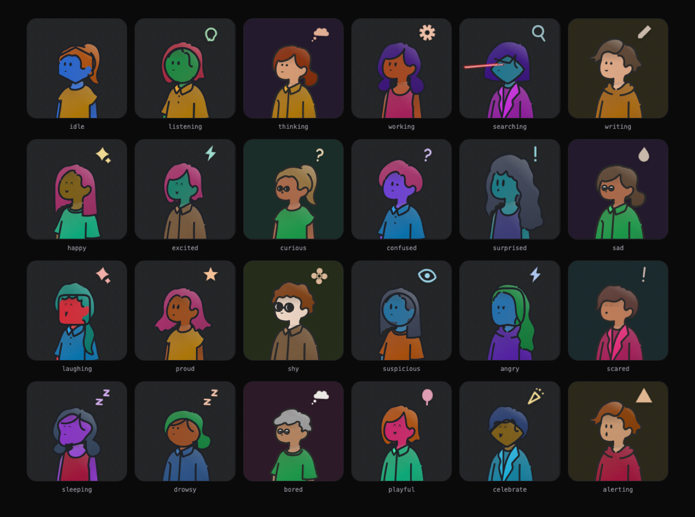

# avatar-motion

**Living avatars for AI agents and people.** One string in, one character out —
the same one every time. It blinks, breathes, looks around, and shows what your
agent is doing right now.

No build step. No dependencies. MIT, all of it.

**[avatar.dxcore35.eu](https://avatar.dxcore35.eu)** · **[the lab](https://avatar.dxcore35.eu/lab.html)**


## Built on

The drawn people are **not this project's artwork**. Every head, body, bottom,
item and pair of glasses comes from
**[Humation](https://github.com/endo-yusuke/humation)** (MIT), vendored
unmodified under `vendor/@humation/`. What is added here happens at runtime and
never edits that art: the drawn-on eyes are cut out, the head is measured as a
sphere, flat fills are repainted as lit gradients, and texture is added.

The eye motion on that sphere — saccades, blinks, the spring — is a port of a
public gist by
[Jérémy Perret](https://gist.github.com/smontlouis/49a4c9303de70118a90dc43badc1aba5)
(MIT).

Everything else — the icon set, the textures, the states, the shader — is
original. Full detail in [`NOTICE.md`](NOTICE.md).

## Install

```bash
bun add github:dxcore35/avatar-motion
```

## Use

```html
<script type="module" src="avatar-motion/src/avatar-motion.js"></script>

<avatar-motion seed="reception-01" state="listening"></avatar-motion>
```

Only `seed` is required. It is a web component, so the same tag works in plain
HTML, React, Vue or Svelte.

## Properties

| Attribute | Values | What it does |
|---|---|---|
| `seed` | any string | The id. The same string is always the same character. |
| `kind` | `agent` · `customer` | An AI mascot, or a person. Agents may run tools; people do not. |
| `color` | any hex | An agent's signature colour. It becomes the skin. |
| `gender` | `male` · `female` | Constrains hair and lower body. Omit for either. |
| `age` | a number | Greying, reading glasses, a slower pace. |
| `state` | 39 of them, below | What the face is doing. |
| `skull` | `round` `squircle` `hexagon` `egg` `pear` `capsule` `diamond` `shield` `triangle` `blob` | The generated head shape. Agents only. |
| `head` | 24 names | Force a hairstyle instead of letting the seed pick. |
| `body` | 8 names | Force a top. |
| `bottom` | 8 names | Force a lower body. |
| `item` | 43 names | Force a hat, pet or held object. |
| `glasses` | `none` `round` `tiny` | Force glasses. Otherwise age and tool calls decide. |
| `emblem` | `icon` · `item` · `off` | The symbol over the head, the Humation hat, or nothing. |
| `mouse-interactive` | flag | The eyes follow the pointer. |
| `demo` | flag | Run a scripted demo on a loop. |
| `flat` | flag | Skip lighting, texture and grain. |
| `no-aura` | flag | Never claim a WebGL surface. |
| `no-mount` | flag | Skip the arrival animation. |
| `transparent-bg` | flag | Do not paint the avatar's own background. |

`avatar options` prints every legal part name at any time.

### Methods

```js
el.setState('thinking')
el.runTool({ name: 'search_calendar', args: '{ day: "tue" }', result: '3 slots' })
el.send({ type: 'speech.attach', stream })   // the mouth follows real audio
el.blink(); el.spin(); el.remount(); el.playAct('scan')
```

## States

39 of them. One attribute changes the eyes, brow, mouth, posture and the symbol
over the head, together.



## Tool calls

When an agent calls a tool the face performs it: glasses on, a bubble with the
call in it, the outfit running hot, and the eyes doing the lookup. A search gets
laser eyes.


## CLI

Drive any avatar in an open page from a terminal. Start the bridge, add
`?bridge` to the page URL, then:

```bash
avatar state listening
```

```bash
avatar random kind=customer
```

```bash
avatar options
```

`avatar tool.start name=search_calendar`, `avatar parts skull=hexagon`,
`avatar act.play scan` and `avatar say "text"` work the same way. Every command
reports what it did, and a wrong value comes back with the legal ones attached.

## MCP — let Claude drive the face

```bash
claude mcp add avatar -- bun /path/to/avatar-motion/mcp/server.js
```

That is the whole setup. Twenty-one tools appear — `avatar_state`,
`avatar_tool_start`, `avatar_random`, `avatar_parts`, `avatar_options` and the
rest — generated from the same command list the CLI uses, so the two can never
drift. Ask Claude to make the receptionist look busy, and it will.

## Run it

```bash
bun run dev
```

<http://localhost:4330> is the site, `/lab.html` is the workbench — every state,
all 41 eye types, the spring, an endless crowd.

```bash
bun run bridge
```

Starts the bridge on :4332, which is what the CLI and MCP talk to.

## Deploy

Any static host works; there is no server code. [`DEPLOY.md`](DEPLOY.md) covers
Docker plus a Cloudflare Tunnel — an outbound-only connection that publishes the
site over HTTPS without opening a port on your machine.

```bash
docker compose up -d --build
```

## Speech

The mouth is driven by the audio the agent is actually producing, not by a
timer. Loudness opens the jaw; the brightness of the sound widens or rounds the
lips. There is no phoneme model and no language assumption — it works on Slovak
the same as on English, because it is reading the waveform.

```js
el.send({ type: 'speech.attach', stream })   // a MediaStream, an <audio>, or a node
```

## How it behaves in production

One `requestAnimationFrame` drives every avatar on the page. Off-screen avatars
and hidden tabs stop completely. The simulation runs at a fixed 120 Hz step,
separate from drawing, so a slow frame changes nothing about the motion.
`prefers-reduced-motion` is honoured. The WebGL aura is pooled three deep, and
any avatar can decline it with `no-aura`.

## Files

| Path | What |
|---|---|
| `index.html` | the landing page |
| `lab.html` | the lab |
| `src/avatar-motion.js` | the `<avatar-motion>` element |
| `src/humation.js` | compose, cut the eyes, measure the sphere, the look pass |
| `src/engine.js` | the simulation and the draw pass |
| `src/states.js` | 39 states: pools, cadences, body motion, tool scripts |
| `src/expressions.js` | parametric eye and mouth rings |
| `src/motion/` | gaze, body, sphere, eye acts |
| `src/render/` | textures, shading, icons, emblems, skulls |
| `src/control.js` | one command set, shared by the page, the CLI and MCP |
| `src/variation.js` | one definition of "a random avatar" |
| `src/speech.js` | the mouth, from a waveform |
| `src/sound.js` | the tap heard when a face is made |
| `bin/avatar.js` | the CLI |
| `mcp/server.js` | the MCP server |
| `tools/bridge.js` | the wire between a process and a page |
| `tools/shot.sh` | rebuilds the images above |

## Licence

MIT — [`LICENSE`](LICENSE). Third-party credits in [`NOTICE.md`](NOTICE.md).
